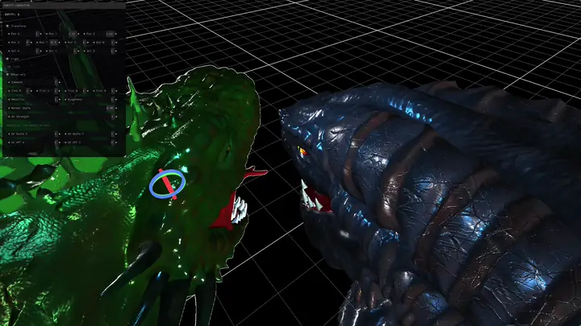

# hyprie

`hyprie` is a custom 3D engine built for a simulation-driven tile world.


<p align="center">
  
  
</p>
<p align="center">
  
  
</p>


### :white_square_button: features

**Core**
- Compile-time configurable [pool allocator](https://github.com/esterlein/metapool)
- Chase-Lev work-stealing scheduler with DV-MPMC injection
- Custom ECS with hierarchical transform graph
- Asset system with GPU resource deduplication
- TOML-based scene parser

**Rendering**
- Command-based multi-pass renderer
  - Queue sorting
  - Opaque / transparent split
  - Frustum culling
- Material system with fixed ORM(H) + emissive PBR (clearcoat - wip)
- Cook–Torrance GGX microfacet BRDF (Smith masking-shadowing, Schlick Fresnel)
- Multi-light forward shading (directional, point, spot)
- Mask-based object outline
- sokol-gfx backend

**Simulation**
- Layered sparse tilemap

**Tools**
- glTF / GLB loader
- Gizmo system (wip)


### :white_square_button: build & run

Requires cmake, clang++ or g++, and [sokol-shdc](https://github.com/floooh/sokol-tools-bin) in `$PATH` or via `SHDC=`.

```bash
./setup_submodules.sh
./build.sh shd          # only generate shaders
./build.sh              # build
./build.sh run          # build and run
./build.sh clean        # clean and build
./build.sh clean run    # clean, build and run
```
