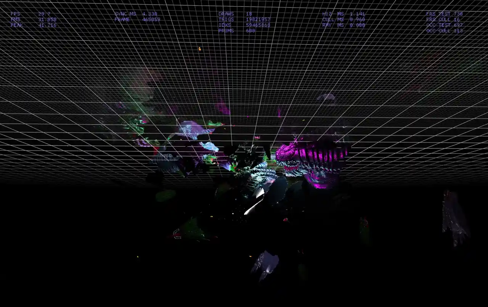
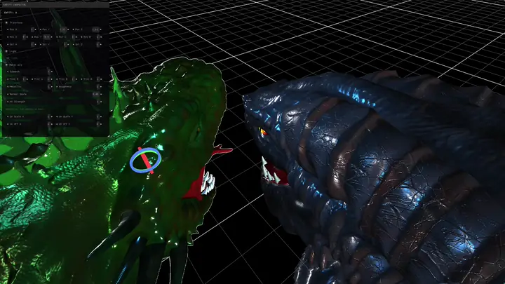
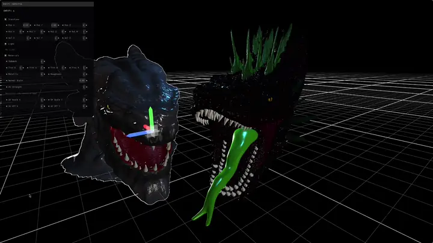

# hyprie

`hyprie` is a custom 3D engine built for a simulation-driven tile world.


<p align="center">
  
</p>


### :white_square_button: latest feature - visibility system

`sokol` has proven to be a solid choice as a clean abstraction layer to build the core systems around. It uses Pipeline State Objects, so the rest of the engine naturally aligns with a modern API.
The downside is that it doesn't support indirect draws, which rules out a few techniques, such as GPU-driven occlusion culling without readbacks.

A CPU Hi-Z prepass proved to be a viable alternative. After experimenting with several approaches that resulted in submesh flickering, I settled on generating convex hulls for every non-skinned submesh (everything is an occludee) and authoring low-poly twins in Blender for meshes intended to act as occluders.

The occluder twin is strictly enclused by the visible model. An AABB frustum culling test before the occlusion test is necessary for performance.

The demonstration below is running on an AMD Ryzen 7 Linux laptop with integrated Radeon 780M graphics, rendering relatively complex models (around 20 million triangles total, which is a bottleneck on this hardware).


https://github.com/user-attachments/assets/4632e4ea-1174-4ea7-bac9-82f935ffa869


The resulting main scene submission pipeline looks like this (only the main culling stage is currently parallelized):


<p align="center">
  
</p>


### :white_square_button: engine features

**Core**
- Compile-time configurable [pool allocator](https://github.com/esterlein/metapool)
- Chase-Lev work-stealing scheduler with DV-MPMC injection
- Custom ECS with hierarchical transform graph
- Multithreaded SIMD raycast
- Engine-native QuickHull DOD implementation
- Asset system with resource deduplication
- TOML-based scene parser

**Rendering**
- Command-based multi-pass renderer
  - Instancing
  - Batching
- Data-oriented submission
  - Texture array indexing
  - Unified geometry buffers
- Material system with fixed ORM(H) + emissive PBR
- Cook–Torrance GGX microfacet BRDF (Smith masking-shadowing, Schlick Fresnel)
- Multi-light forward shading (directional, point, spot)
- Mask-based object outline
- sokol-gfx backend

**Visibility**
- Multithreaded SIMD frustum culling
- Multithreaded SIMD Hi-Z occlusion culling

**Simulation**
- Layered sparse tilemap

**Tools**
- glTF / GLB loader
- Gizmo system (wip)


### :white_square_button: roadmap

- Skeletal animation
- LOD system
- Render DAG
  - Shadow mapping
  - Tone mapping
  - Volumetric fog
- IBL
- Clustered lighting


<p align="center">
  
</p>
<p align="center">
  
</p>


### :white_square_button: build & run

Requires cmake, clang++ or g++, and [sokol-shdc](https://github.com/floooh/sokol-tools-bin) in `$PATH` or via `SHDC=`.

```bash
./setup_submodules.sh
./build.sh shd          # only generate shaders
./build.sh              # build
./build.sh run          # build and run
./build.sh clean        # clean and build
./build.sh clean run    # clean, build and run
```

